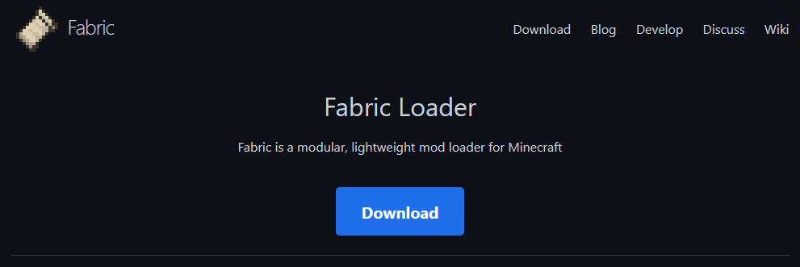
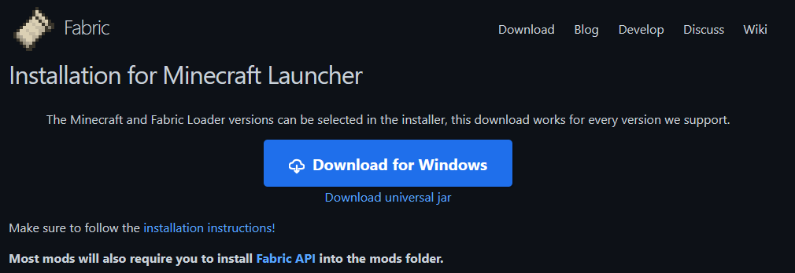

# FOR IDIOTS WHO DON'T KNOW HOW TO INSTALL MODS
This resource pack *will NOT* work on vanilla Minecraft! It requires the [Vistas](https://modrinth.com/mod/vistas) mod in order to use. You were directed here because you were an idiot and didn't read the instructions carefully. (Sorry, it's just the truth.) This document explains how to use Fabric mods (of which Vistas is one). It assumes you're using the stock Minecraft launcher (which, if you were directed here, you probably are).
1. First, you need to install the Fabric mod loader. Visit [fabricmc.net](https://fabricmc.net) and click the big blue Download button near the top. 
2. On that page, click Download for Windows. (unless you are on a Mac, then click the smaller Download universal JAR option. You may need to install Java on your computer if you use this option) 
3. Open the installer you just downloaded, and unless you want a specific Minecraft version, just click Install.
4. Once the installer finishes installing, you will need to open your .minecraft folder. To do so, open the Minecraft Launcher, select Java Edition in the left side, then go to the Installations tab. Click the folder icon next to the newly created Fabric installation, and a folder window will open up. Create a new folder and name it mods. This is where you put mods that you download.
5. Download the [Fabric API](https://modrinth.com/mod/fabric-api) and [Vistas](https://modrinth.com/mod/vistas), then move the files to the mods folder you just created.

## You have successfully installed the mods needed for this resource pack to work.
Pat yourself on the back. You deserve it.
